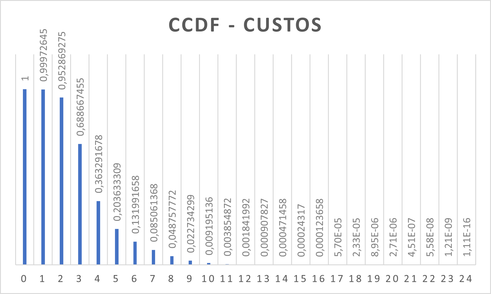

# BGP Stable State Simulator

## Introduction

In the context of the "Network Algorithms and Applications" course, our project involves the implementation of a simulator and an algorithm to achieve the stable state of the BGP (Border Gateway Protocol) for any graph, considering the commercial restrictions that characterize this protocol and the cost of each connection.

## Theoretical Background

The Border Gateway Protocol (BGP) is fundamental for the functioning of the internet, allowing Autonomous Systems (ASes) to exchange routing information to ensure data packets find an optimal path through the complex topology of the internet. The protocol operates under a set of commercial relationships and policies that influence routing decisions, leading to scenarios where the shortest path is not always chosen due to commercial agreements.

### Simulator

Our simulator is an event-driven calendar capable of mimicking message exchanges between ASes. It considers message reception times, queue delays for each connection, and commercial relationships between ASes. To simulate these interactions accurately, we represented the network graph using an adjacency list, with each node maintaining a routing table to select the best estimate for each destination based on the messages exchanged with its neighbors.

### Algorithm

We implemented a modified version of the Reverse Generalized Bellman-Ford Algorithm, tailored to accommodate the intricacies of BGP's commercial constraints and connection costs. This approach required careful consideration of route types and costs, leading to a design that uses multiple stacks to manage the exploration of routes according to BGP's commercial relationships.

## Results

The application of our BGP Stable State Simulator to a large network has yielded insightful data on the costs associated with different routes. The Complementary Cumulative Distribution Function (CCDF) plot below showcases the probability distribution of these costs, highlighting the efficiency and economic implications of the routing decisions made by the algorithm.

## Conclusion

This project underscores the complexity and the computational demands of simulating AS network behaviors and achieving a stable state in BGP routing. Through our simulator and algorithm, we delve into the nuanced interplay of routing decisions influenced by commercial agreements, highlighting the efficiency and challenges of achieving optimal routing paths in the internet's backbone.

## Contributors

- Miguel Quinteiro Ribeiro
- Diogo José Pereira Araújo

For more detailed information about our algorithm, implementation, and findings, please refer to the accompanying academic paper.